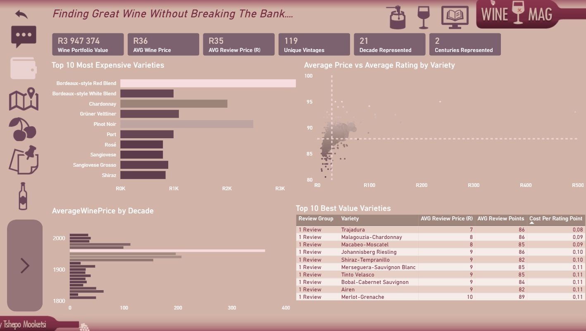
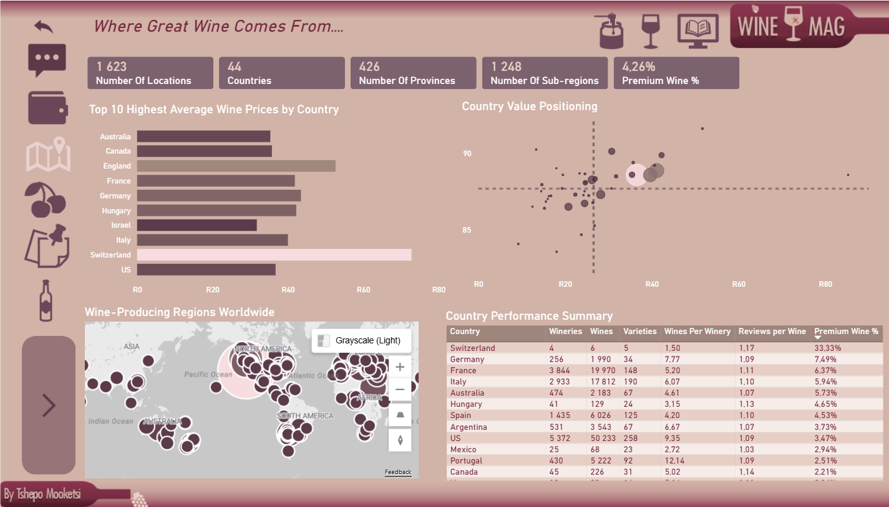
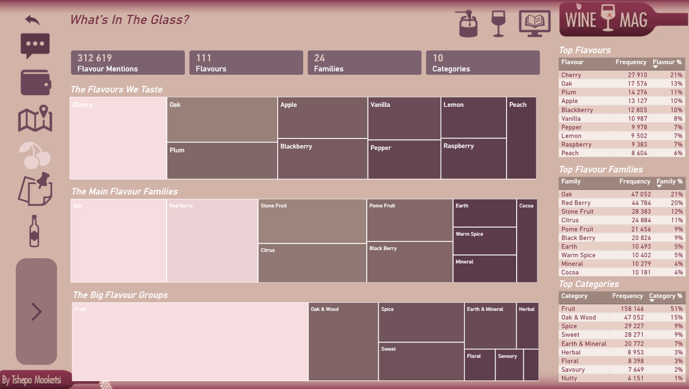
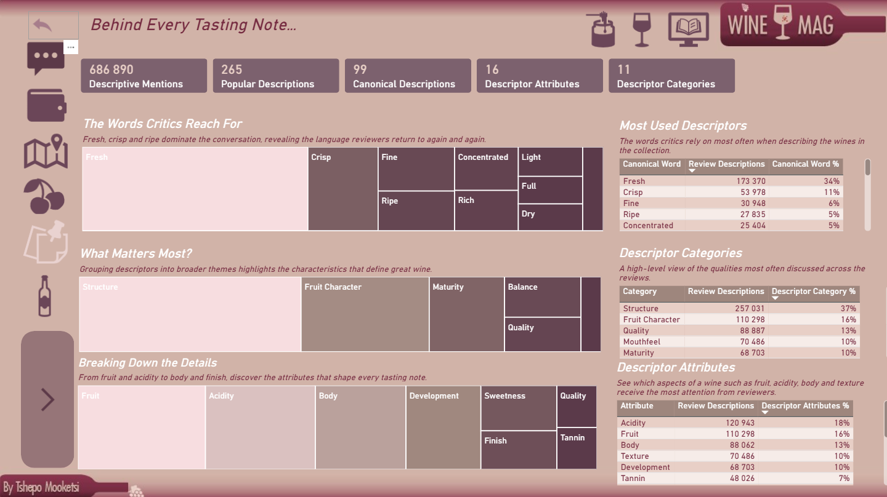
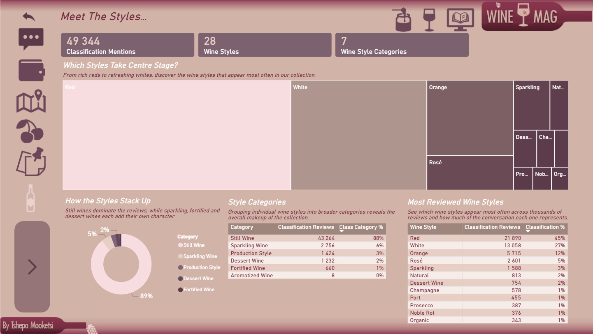
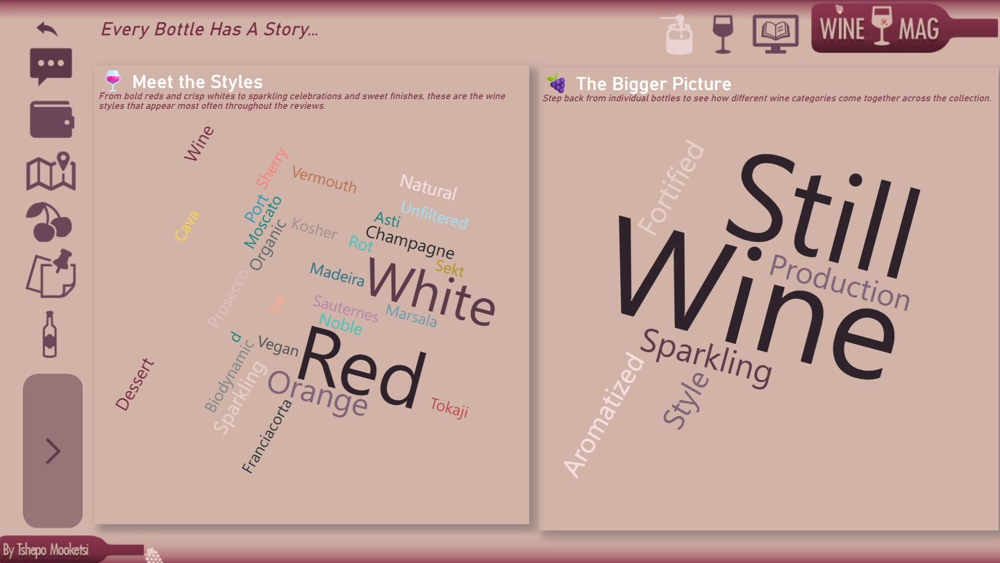
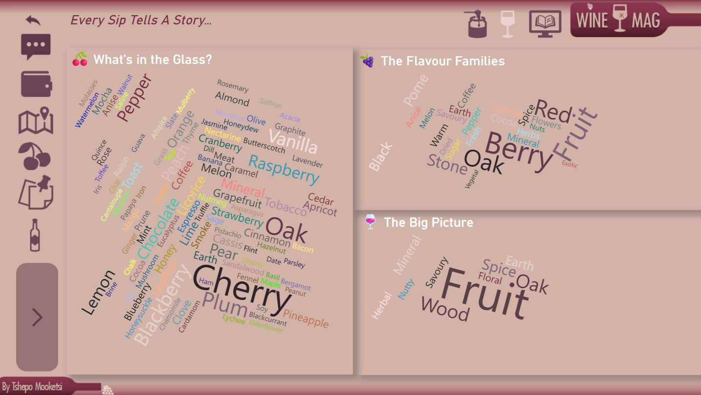
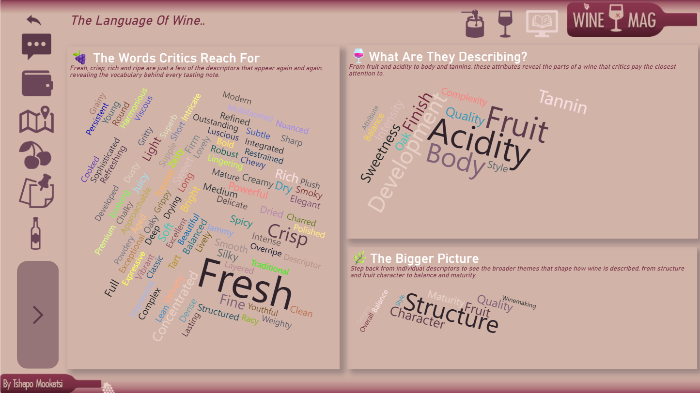

# Wine-Mag-Review-Dashboard 📊
*About Project*
---
The objective of this project was to transform a publicly available wine review dataset into an interactive analytics dashboard. The goal was to uncover insights into wine quality, geographical distribution, flavour profiles, wine styles and the language used by wine critics.

Reviewer descriptions were extracted and transformed from unstructured text into a dimensional text model. This allowed the analysis of flavour descriptors, wine characteristics and reviewer vocabulary alongside traditional measures such as price, ratings and location.

The other aim was to create a data-driven dashboard with a touch of creativity, making the analysis more inviting for both wine enthusiasts and analysts.


---
## Live Dashboard 📊 

👉 **[Launch Dashboard](https://app.fabric.microsoft.com/view?r=eyJrIjoiYjVjNDEzMmItMGFkNC00YTM1LWI4ZDktMzgwMDU3ZjU3OTFjIiwidCI6IjJhYTYxN2E4LTI3NDItNDEwMi04NjgzLTFmYTMzZGE4Nzc3YiJ9&embedImagePlaceholder=true)**

*Experience the interactive version of this dashboard in Power BI.*


---

## Understanding the Dataset

- Dataset containing ~ 130 000 wine reviews
-	Structured data including wine reviews, country, point, variety, winery, etc
-	Unstructured text which comprised of reviewer text. 


---

## 1. Data Modelling 
### 1.1. Data Modelling

The dataset was separated into two fact tables based on the different levels of detail within the data.

The **Wine Review fact table** operates at review level and contains measures such as price and review points, together with foreign keys linking to the wine, location and taster dimensions. The **Review Word fact table** operates at individual word level, allowing the unstructured reviewer descriptions to be analysed as structured data.

The supporting dimensions were separated into their respective business entities:

- **Location** – country, province, region and sub-region
- **Taster** – reviewer information
- **Wine** – wine title, variety and winery
- **Wine Review Distribution** – review counts and review groups
- **Bridge Wine Vintage** – vintage information derived from the wine title

The **BridgeWineVintage** table was created by extracting numeric values from the wine title. The title was split into individual components, the resulting columns were unpivoted, and non-numeric values were removed. This produced a separate vintage structure which was then used to derive *decades and centuries* for historical analysis.

Duplicate dimension records were removed and surrogate keys were introduced to provide unique identifiers for the dimension entities. The corresponding keys were then assigned to the fact tables, allowing the descriptive attributes to remain within their respective dimensions rather than being duplicated in the fact tables.

The resulting model follows a star-schema approach, with the review-level fact table at the center of the traditional wine analysis and the word-level fact table supporting the text analysis.

### 1.2. Text Analytics Model

The second part of the model was created from the reviewer descriptions.

The original review description was unstructured and contained a large number of words that were not useful for the analysis. A referenced copy of the original dataset was created and the original query was disabled from loading. The review ID and description were retained, after which the description was split into individual words and transformed into a word-level structure.

The text was then cleaned by:

Removing numeric values from the extracted words.
- Creating a list of generic/stop words and filtering them from the analysis.
- Creating a **Wine Classification table** to categorise wine styles and broader categories.
- Creating a **Wine Flavour table** to classify flavour descriptions into flavours, families and broader categories.
- Creating a **Wine Descriptor table** to classify descriptive words by attribute and category.
- Creating a **Wine Descriptor Normalisation table** to group variations of similar words under a common canonical word.

For example, variations such as Age, Aged and Ageing can be grouped under the canonical word Age. This allows the analysis to identify broader patterns in the language used by critics rather than treating every variation as a completely separate term.

### 1.3. The final model therefore contains two complementary analytical areas:

The data model was divided into two complementary analytical areas. The first focuses on the wine review itself, while the second focuses on the language used within the review descriptions. This separation allowed quantitative wine analysis and text analysis to be developed without mixing different levels of granularity.

### Wine Review Analysis

```text
Wine Review
│
├── Price
├── Points
├── Wine
├── Location
├── Taster
│
└── Bridge Wine Vintage
       │
       ├── Decade
       └── Century
```
---
### Review Language Analysis

```text
Review Description
        │
        ↓
Split into Individual Words
        │
        ↓
ReviewWordFactDetail
        │
        ├── Flavour
        │      └── Family
        │
        ├── Wine Classification
        │      └── Category
        │
        └── Descriptor Normalisation
               ├── Canonical Word
               ├── Attribute
               └── Category
```
### 1.3. The above diagram provides the ability to break down the data into three analytical layers 
- **Wine & Commercial Analysis**: Price, ratings, value, wine varieties, vintages and geographical distribution.
- **Wine Classification**: Wine styles and categories, allowing the reviews to be grouped into broader wine characteristics.
- **Review Language & Text Analytics**: Flavours, families, categories, descriptors, attributes and canonical words extracted from unstructured review descriptions.

---

## 2. Key insights
### 2.1 What the critics are saying

- There are 1.09 reviews per wine on average, suggesting that most wines in the dataset have only been reviewed once.
- Pinot Noir has been reviewed the most, followed by Chardonnay and Cabernet varieties.
- Most wines receive a rating between 86 and 91 points.
- Wine variety appears to provide more opportunities for comparison than individual wine titles, with some varieties receiving substantially more reviews than others.

---

---


### 2.2 Finding great wine without breaking the bank

- Bordeaux-style Red Blend and Bordeaux-style White Blend both appear in the top 10 most expensive varieties.
- A large proportion of the older wines in the dataset fall between the 1930s and 1960s.
- There appears to be a positive relationship between average wine price and average rating, although higher prices do not always correspond to higher ratings.
- The value-for-money analysis highlights several lower-priced varieties that achieve relatively strong review scores.

---

---


### 2.3 Where great wine comes from 

- Europe and North America contain many of the higher-priced wine-producing regions in the dataset.
- Switzerland has the highest proportion of premium-rated wines, although the number of wines represented is relatively small.
- The data suggests a positive relationship between wine price and rating, with some higher-priced wines receiving higher average scores.
- The geographic distribution also shows that the dataset is heavily represented by European and North American wine-producing regions.

---

---

### 2.4 What's in the glass

- The reviews contain over 312,000 flavour mentions, showing how frequently taste characteristics appear in the critics' descriptions.
- Cherry is the most frequently mentioned flavour at 21%, followed by Oak at 13%, Plum at 11% and Apple at 10%.
- At family level, Oak and Red Berry dominate the descriptions, accounting for 21% and 20% of flavour mentions respectively.
- Fruit is by far the largest flavour category, accounting for 51% of all flavour mentions, followed by Oak & Wood at 15% and Spice and Sweet at 9% each.
- The progression from individual flavours to broader families and categories shows that although critics use hundreds of different words, many of these descriptions can be grouped into a smaller number of recurring flavour profiles.


---

---

### 2.5 Behind every tasting note

- Critics place strong emphasis on freshness, structure and fruit character when describing wines.
- Acidity, fruit and body are among the attributes mentioned most frequently.
- Structure is the most frequently discussed descriptor category, followed by fruit character and quality.

---

---

### 2.5 Meet the styles

- Red and White wines dominate the reviews, accounting for 45% and 27% of all wine style mentions respectively.
- Still Wine represents 88% of the classifications, with Sparkling Wine accounting for 6%.
- The remaining categories, including Production Style, Dessert Wine and Fortified Wine, make up a much smaller proportion of the reviews.
- Although traditional still wines dominate the dataset, the 28 individual styles reveal a much broader range of wines being discussed by critics.

---

---

### 2.6 Every bottle has a story

- Red and white wines dominate the wine styles represented in the reviews.
- Still wine makes up the overwhelming majority of the broader wine style categories.
---

---

### 2.7 Every sip tells a story

- Red, Berry, Oak and Fruit are some of the most frequently mentioned flavour characteristics in the reviews.
- Fruit is by far the largest flavour category, accounting for 51% of all flavour mentions.
- Oak & Wood and Spice are also prominent flavour categories.
---

---


### 2.7 The language of wine

- Critics use a wide range of words to describe the same characteristics of wine. Canonical word normalisation grouped variations of similar descriptors into common terms, making it easier to identify the language used most frequently.
- Fresh is the most frequently used canonical descriptor, followed by Crisp, Fine and Ripe.
- This shows how unstructured review text can be transformed into structured analytical data.
---

---

## 3. Recommendations 
- The analysis suggests that wine variety may be more useful for comparison than individual wine titles, particularly for enthusiasts looking to explore different styles.
- Increasing the number of reviews for individual wine titles could provide more information for collectors interested in specific vintages and wines.
- Older wines, particularly those from the 1930s to 1960s, could be explored further as potential collector-focused wines based on their age and review history.
- The value-for-money analysis could be used to identify lower-priced varieties with relatively strong ratings for further exploration.
- European and North American regions dominate the dataset, so further analysis could explore whether this reflects the global wine market or simply the composition of the review dataset.


 # Author

**Tshepo Mooketsi**

Business Intelligence Analyst with 10 years of experience delivering analytics solutions across the telecoms and retail industries. Microsoft Certified Power BI Data Analyst Associate (PL-300) with expertise in SQL, Power BI, data warehousing, dashboard development, requirements analysis and stakeholder engagement.

### Skills
- Power BI
- DAX
- Power Query
- Data Modelling
- Business Analysis
- Requirements Gathering
- Data Warehousing (EDW)

### Certifications
- Microsoft Certified: Power BI Data Analyst Associate (PL-300)
- [View Microsoft Certification](Images/Power_BI_Certification.pdf)

### Connect With Me
- LinkedIn: [Tshepo Mooketsi](https://www.linkedin.com/in/tshepo-mooketsi-77b892116)
