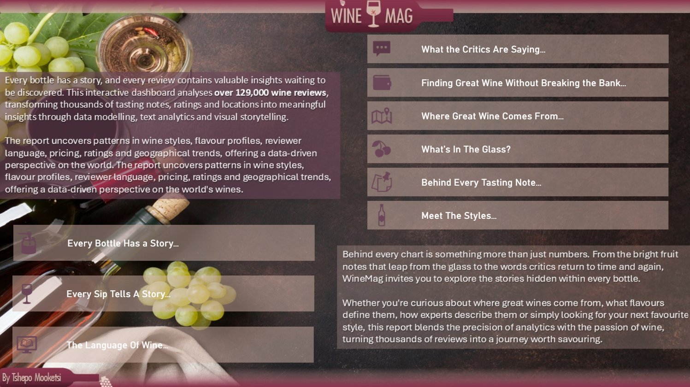
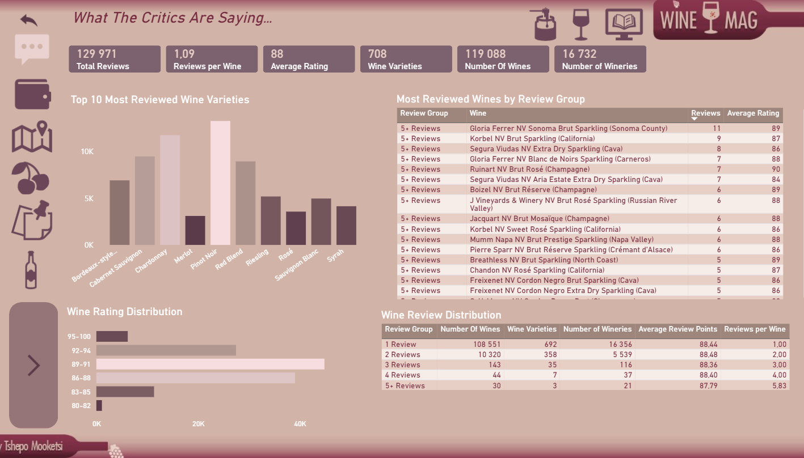

# Wine-Mag-Review-Dashboard 📊
*About Project*
---
The objective of this project was to transform a publicly available wine review dataset into an interactive analytics dashboard. The goal was to uncover insights into wine quality, geographical distribution, flavour profiles, wine styles and the language used by wine critics.

Reviewer descriptions were extracted and transformed from unstructured text into a dimensional text model. This allowed the analysis of flavour descriptors, wine characteristics and reviewer vocabulary alongside traditional measures such as price, ratings and location.

The other aim was to create a data-driven dashboard with a touch of creativity, making the analysis more inviting for both wine enthusiasts and analysts.



---
## Live Dashboard 📊 

👉 **[Launch Dashboard](https://app.fabric.microsoft.com/view?r=eyJrIjoiYjVjNDEzMmItMGFkNC00YTM1LWI4ZDktMzgwMDU3ZjU3OTFjIiwidCI6IjJhYTYxN2E4LTI3NDItNDEwMi04NjgzLTFmYTMzZGE4Nzc3YiJ9&embedImagePlaceholder=true)**

*Experience the interactive version of this dashboard in Power BI.*


---

## Understanding the Dataset

- Dataset containing ~ 130 000 wine reviews
-	Structured data including wine reviews, country, point, variety, winery, etc
-	Unstructured text which comprised of reviewer text. 


---

## 1. Data Modelling 
### 1.1. Data Modelling

The dataset was separated into two fact tables based on the different levels of detail within the data.

The **Wine Review fact table** operates at review level and contains measures such as price and review points, together with foreign keys linking to the wine, location and taster dimensions. The **Review Word fact table** operates at individual word level, allowing the unstructured reviewer descriptions to be analysed as structured data.

The supporting dimensions were separated into their respective business entities:

- **Location** – country, province, region and sub-region
- **Taster** – reviewer information
- **Wine** – wine title, variety and winery
- **Wine Review Distribution** – review counts and review groups
- **Bridge Wine Vintage** – vintage information derived from the wine title

The **BridgeWineVintage** table was created by extracting numeric values from the wine title. The title was split into individual components, the resulting columns were unpivoted, and non-numeric values were removed. This produced a separate vintage structure which was then used to derive *decades and centuries* for historical analysis.

Duplicate dimension records were removed and surrogate keys were introduced to provide unique identifiers for the dimension entities. The corresponding keys were then assigned to the fact tables, allowing the descriptive attributes to remain within their respective dimensions rather than being duplicated in the fact tables.

The resulting model follows a star-schema approach, with the review-level fact table at the center of the traditional wine analysis and the word-level fact table supporting the text analysis.

### 1.2. Text Analytics Model

The second part of the model was created from the reviewer descriptions.

The original review description was unstructured and contained a large number of words that were not useful for the analysis. A referenced copy of the original dataset was created and the original query was disabled from loading. The review ID and description were retained, after which the description was split into individual words and transformed into a word-level structure.

The text was then cleaned by:

Removing numeric values from the extracted words.
- Creating a list of generic/stop words and filtering them from the analysis.
- Creating a **Wine Classification table** to categorise wine styles and broader categories.
- Creating a **Wine Flavour table** to classify flavour descriptions into flavours, families and broader categories.
- Creating a **Wine Descriptor table** to classify descriptive words by attribute and category.
- Creating a **Wine Descriptor Normalisation table** to group variations of similar words under a common canonical word.

For example, variations such as Age, Aged and Ageing can be grouped under the canonical word Age. This allows the analysis to identify broader patterns in the language used by critics rather than treating every variation as a completely separate term.

### 1.3. The final model therefore contains two complementary analytical areas:

The data model was divided into two complementary analytical areas. The first focuses on the wine review itself, while the second focuses on the language used within the review descriptions. This separation allowed quantitative wine analysis and text analysis to be developed without mixing different levels of granularity.

### Wine Review Analysis

```text
Wine Review
│
├── Price
├── Points
├── Wine
├── Location
├── Taster
│
└── Bridge Wine Vintage
       │
       ├── Decade
       └── Century
```
---
### Review Language Analysis

```text
Review Description
        │
        ↓
Split into Individual Words
        │
        ↓
ReviewWordFactDetail
        │
        ├── Flavour
        │      └── Family
        │
        ├── Wine Classification
        │      └── Category
        │
        └── Descriptor Normalisation
               ├── Canonical Word
               ├── Attribute
               └── Category
```

## 2. Key insights
### 2.1 What the critics are saying...

- There are 1.09 reviews per wine on average, suggesting that most wines in the dataset have only been reviewed once.
- Pinot Noir has been reviewed the most, followed by Chardonnay and Cabernet varieties.
- Most wines receive a rating between 86 and 91 points.
- Wine variety appears to provide more opportunities for comparison than individual wine titles, with some varieties receiving substantially more reviews than others.

- ---

---
